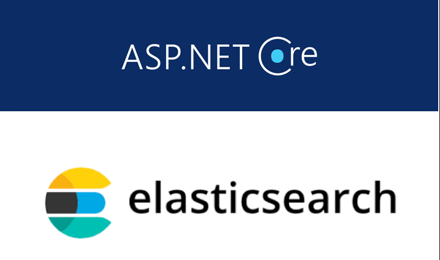
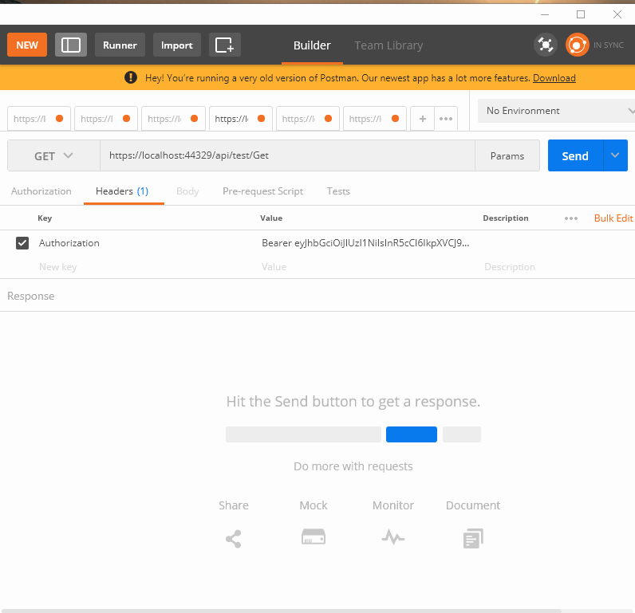
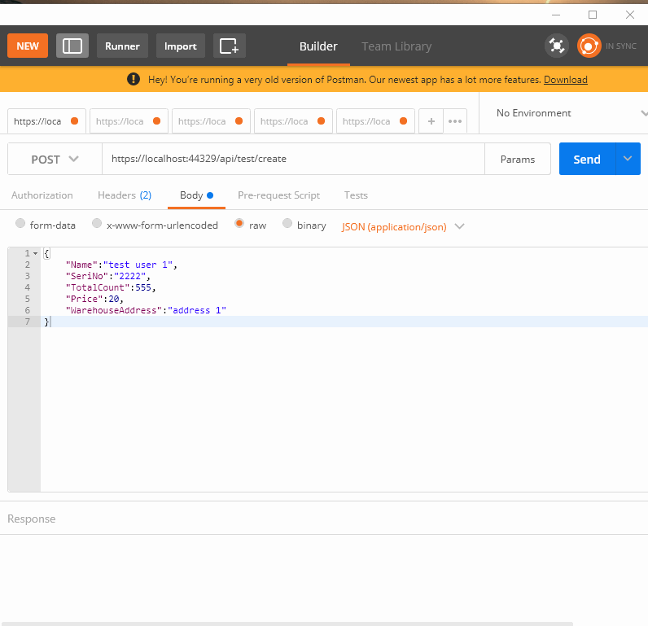
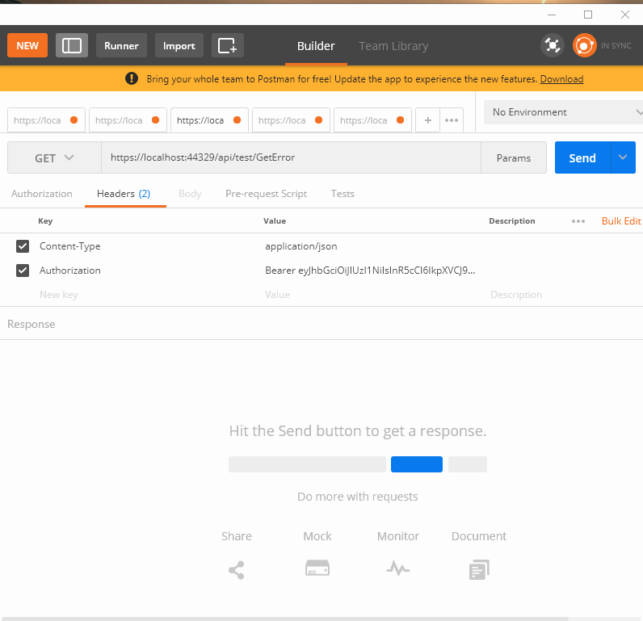
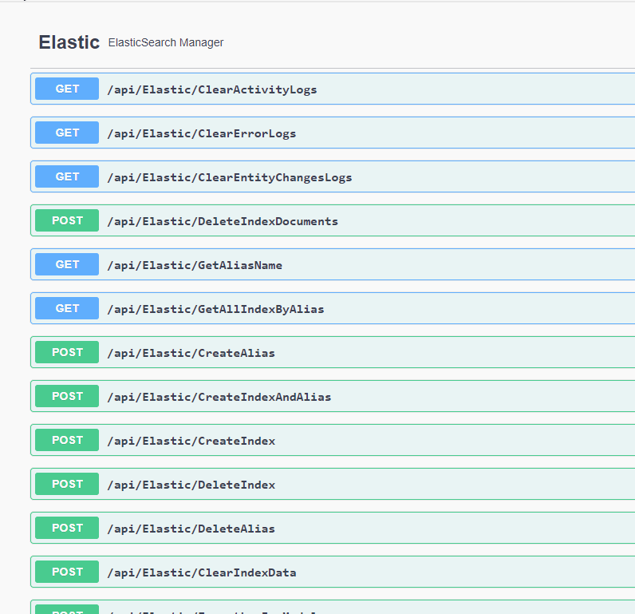

# .Net Core - Elastic Search Log Everything

[](https://github.com/hasansahinnn/.NetCore_ElasticSearchv7_LogEverything/)  [](https://github.com/hasansahinnn/.NetCore_ElasticSearchv7_LogEverything/)  [](http://badges.mit-license.org) [](https://github.com/hasansahinnn/.NetCore_ElasticSearchv7_LogEverything/issues)

It is a library where you can log all the movements that occur in your application.

## Specifications

  - Specific Logging. Create Index and Log Your Model.
  - Catches Database Changing (Update,Delete) and Logs with Current User Id.
  - Logs Selected Endpoints with Ip Address, Query or Body Params and Current User Id.
  - Catches All Exception in Project and Logs with Exception Message, Status Code and Current User Id.
  - Elastic Search Management Service Class. Index Management, Alias Management, Search Logs.
  
## Dependencies

  - Net Core 3
  - NEST Library
  - Entity Framework
  
## Links
  - <a href="https://www.elastic.co/downloads/elasticsearch" >**Elastic Search Install**</a>
  - <a href="https://www.elastic.co/kibana" >**Elastic Search Gui (Kibana)**</a>

## Screenshots

Activity Log                 |   Entitiy Changes Log
:------------------------------:|:------------------------------:
|  

Error Log                  |  Elastic Search Management
:---------------------------:|:---------------------------:
|  

---

```
  Install-Package ElasticSearchLibrary
```

---

## Service Settings 
 <b>Startup.cs</b>
```net
 public void ConfigureServices(IServiceCollection services)
 {
   services.AddElasticServices();
 }
```
<b>appsettings.json</b>

```json
  "ElasticConnectionSettings": {
    "ConnectionString": {
      "HostUrls": "http://localhost:9200/",
      "UserName": "",
      "Password": ""
    }
  }
```

---


## EndPoint Activity Logging (Controller/Action)


<b> [ActivityFilter(LogAllEndPoints: false)] </b> // -> Add Filter To Your Controller <br>
<b> [LogEndpoint]</b> // if LogAllEndPoints:false -> Use <b>[LogEndpoint]</b> for logging specific endpoints. <br>
<b> [NoLogEndpoint] </b> // if LogAllEndPoints:true -> Use <b>[NoLogEndpoint]</b> for remove logging to specific endpoints.
 
 
---


## Database Entities Logging 

Entity Context Class 
```net

 private IDatabaseLogger dbLogger;
 public ProductContext(DbContextOptions options, IDatabaseLogger _dbLogger) : base(options) 
 {
      this.dbLogger = _dbLogger; 
 }
 public override int SaveChanges() 
 {
      dbLogger.LogChanges(ChangeTracker);
      return base.SaveChanges();
 }
```

Entity Model Class 
```net
 [LogModel]  // ->  Logs All Props
 public class Product
 {
     [DisplayName("Record Id")] // For clarity when displaying Entity Log records
     public int ID { get; set; }
     [LogProp]  // -> Log Specific Props (Remove LogModel Attribute)
     public string Name { get; set; }
     [DisplayName("Seri No")]
     [LogProp]
     public string SeriNo { get; set; }
 }
```


---


## Error Logging (Startup.cs)

```net

 public void Configure(IApplicationBuilder app, IWebHostEnvironment env)
 {
   app.AddElasticErrorHandler();
 }

```
---


## Elastic Management Controller

```net

  public class ElasticController : ElasticSearchController
  {
      public ElasticController(IElasticSearchManager _elasticSearchService) : base(_elasticSearchService) { }
  }

```

---

## License

[](http://badges.mit-license.org)

- **[MIT license](http://opensource.org/licenses/mit-license.php)**
- Copyright 2020 © 
